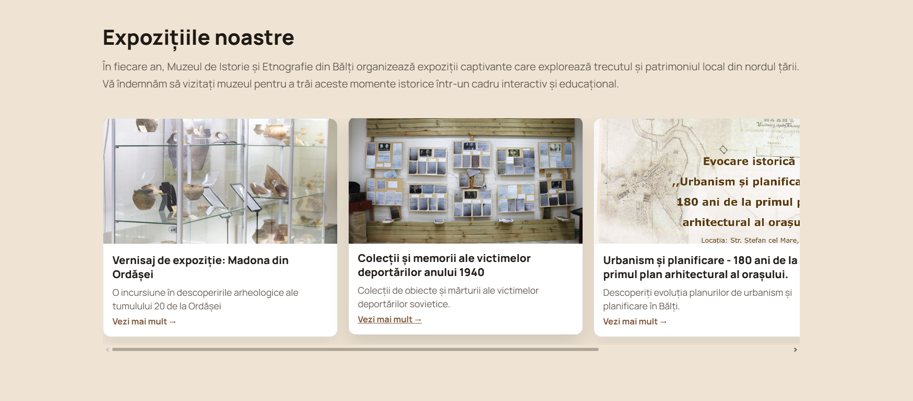

# Museum of History and Etnography Balti 

This project is a landing page for a museum-themed website built for Web Programming Lab 2.  
The page presents exhibitions, museum information, and clear call-to-action areas in a modern style.

## Live Demo

- Visit the site: **https://danganhuh.github.io/tum-web-lab2/**

## Screenshots

## Tech Stack

- [Astro](https://astro.build/) (static site generation)
- HTML + [Tailwind CSS](https://tailwindcss.com/) (via CDN in the layout)

## Local Run

1. Clone the repository.
2. Install dependencies: `npm install`
3. Development server: `npm run dev`
4. Production build: `npm run build` (output in `dist/`)
5. Preview the build: `npm run preview`

## CMS Authentication, Workflow, and Deployment

The CMS is configured in `public/admin/config.yml` with:

- GitHub backend (`name: github`) for direct commits to this repository
- GitHub OAuth login (`base_url` + `auth_endpoint`)
- Editorial workflow (`publish_mode: editorial_workflow`) for Draft -> Review -> Publish

### 1) Configure GitHub OAuth access

1. Open [Decap Bridge](https://decapbridge.com/) and create/connect your GitHub OAuth setup.
2. Allow access only to this repository (`danganhuh/tum-web-lab2`) to keep CMS access restricted.
3. In GitHub repository settings, ensure only authorized collaborators/organization members can push to `master`.

### 2) Verify the editorial flow

1. Go to `/admin` and sign in with an authorized GitHub account.
2. Create or edit content and save as draft.
3. Move the entry to review, then publish it.
4. Confirm the CMS creates a PR/commit according to editorial workflow.

### 3) Verify automatic deployment

- GitHub Actions workflow: `.github/workflows/deploy.yml`
- Trigger: every push to `master` that changes content or site files
- Result: Astro rebuilds and deploys to GitHub Pages from `dist/`

You can monitor status in the repository Actions tab and confirm the live site updates after publish.
