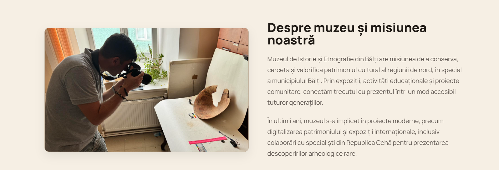
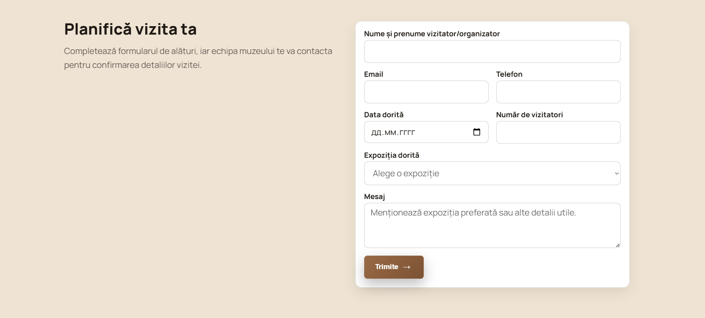

# Museum of History and Etnography Balti 

This project is a landing page for a museum-themed website built for Web Programming Lab 2.  
The page presents exhibitions, museum information, and clear call-to-action areas in a modern style.

## Live Demo

- Visit the site: **https://danganhuh.github.io/tum-web-lab2/**

## Screenshots

## Tech Stack

- HTML5
- CSS3 (vanilla CSS)

## Local Run

1. Clone the repository.
2. Open `index.html` in your browser.
